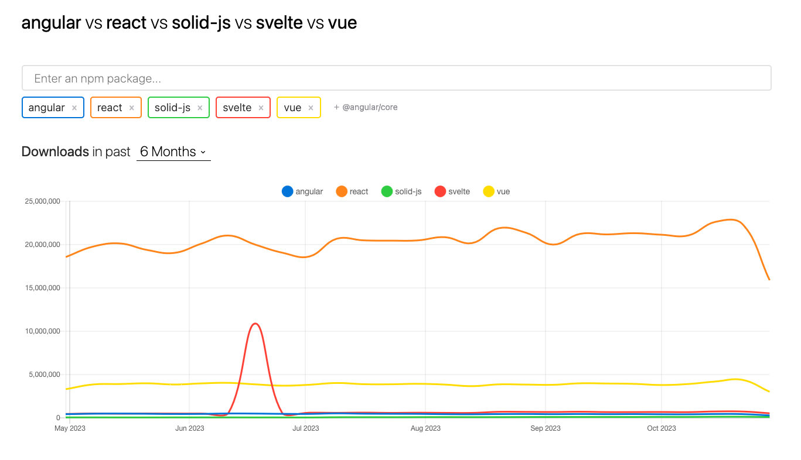

<style scoped>
section {
  background: var(--color-main);
}
</style>

# React vs Solid vs Svelte


---

# Hypothesis


---

# React is bad


---

# What else can we use?


---

# Plain HTML and CSS

---

# ~~Plain HTML and CSS~~


---



---

# SolidJS


---


---

1. TSX
2. Signals
3. Control Flow Components
4. Stores
5. Compilation


---

#### 1. TSX

```tsx
export const Modal: Component<Properties> = (properties) => {
 let dialogReference: HTMLDialogElement | undefined;

 const answer = createSignal(42)

 createEffect(() => {
  const emoji = properties.emoji();

  if (dialogReference === undefined || emoji === undefined) {
   return;
  }

  dialogReference.showModal();
 });

 return (
  <Show when={properties.emoji() !== undefined}>
   <dialog ref={dialogReference}>
    <Emoji emoji={properties.emoji()!} disableSelection={true} />

    <p>And the correct answer is: {answer()}</p>

    <div class={styles.buttons}>
     <Button onClick={properties.onSelection}>Add to Selection</Button>

     <Button onClick={properties.onClose}>CLose</Button>
    </div>
   </dialog>
  </Show>
 );
};
```

---

<div class="columns">
    <ol class="withFade">
        <li>TSX</li>
        <li class="selected"> Signals</li>
        <li>Control Flow Components</li>
        <li>Stores</li>
        <li>Compilation</li>
    </ol>
    <div>
        <ul>
            <li>Backbone of reactivity</li>
            <li>Use proxies</li>
            <li>No callbacks</li>
            <li><code>createSignal</code></li>
            <li><code>createEffect</code></li>
        </ul>
    </div>
</div>

---

### 3. Control Flow Components

```typescript
<For each={state.list} fallback={<div>Loading...</div>}>
  {(item) => <div>{item}</div>}
</For>

<Show when={state.count > 0} fallback={<div>Loading...</div>}>
  <div>My Content</div>
</Show>

<Switch fallback={<div>Not Found</div>}>
  <Match when={state.route === "home"}>
    <Home />
  </Match>
  <Match when={state.route === "settings"}>
    <Settings />
  </Match>
</Switch>
```

---

<div class="columns">
    <ol class="withFade">
        <li>TSX</li>
        <li> Signals</li>
        <li>Control Flow Components</li>
        <li class="selected">Stores</li>
        <li>Compilation</li>
    </ol>
    <div>
        <ul>
            <li>One big signal</li>
            <li>Do not need context</li>
            <li>Not as extensive as Redux</li>
        </ul>
    </div>
</div>

---

<div class="columns">
    <ol class="withFade">
        <li>TSX</li>
        <li> Signals</li>
        <li>Control Flow Components</li>
        <li>Stores</li>
        <li class="selected">Compilation</li>
    </ol>
    <div>
        <ul>
            <li><code>constructor</code>, not<code>render</code></li>
            <li>Does not need optimized libraries</li>
            <li>Smaller footprint</li>
        </ul>
    </div>
</div>

---

# Svelte


---


---

1. Syntax
2. Reactive Statements (Runes)
3. Logic Blocks
4. Stores
5. Compilation


---

#### 1. Syntax

```typescript
<script lang="ts">
  import { type Emoji as EmojiType } from '../api';
  import Button from './Button.svelte';
  import Emoji from './Emoji.svelte';

  export let emoji: EmojiType | undefined;
  export let onClose: () => void;
  export let onSelection: () => void;

  let dialog: HTMLDialogElement | undefined;

  $: emoji !== undefined && dialog?.showModal();
</script>

{#if emoji !== undefined}
  <dialog bind:this={dialog}>
    <Emoji {emoji} disableSelection={true} />

    <div class="buttons">
      <Button on:click={onSelection}>Add to Selection</Button>

      <Button on:click={onClose}>Close</Button>
    </div>
  </dialog>
{/if}

<style>
...
</style>
```

---

<div class="columns">
    <ol class="withFade">
        <li>Syntax</li>
        <li class="selected">Reactive Statements (Runes)</li>
        <li>Logic Blocks</li>
        <li>Stores</li>
        <li>Compilation</li>
    </ol>
    <div>
        <ul>
            <li>The magic word<code>$</code></li>
            <li>Just declaring and updating variables</li>
            <li>Event dispatching</li>
        </ul>
    </div>
</div>

---

#### 3. Logic Blocks

```typescript
{#each array as item}
    <p>{item}</p>
{/end}

{#if suitcase}
    <p>We happy</p>
{:else question}
    <p>42</p>
{\end}

{#await expression}...{:then name}...{:catch name}...{/await}

{#key expression}...{/key}
```

---

<div class="columns">
    <ol class="withFade">
        <li>Syntax</li>
        <li>Reactive Statements (Runes)</li>
        <li>Logic Blocks</li>
        <li class="selected">Stores</li>
        <li>Compilation</li>
    </ol>
    <div>
        <ul>
            <li>writable, readable, readonly, derived</li>
            <li>No context needed</li>
            <li>set, update and subscribe</li>
            <li>Needs <code>$</code>inside a component</li>
        </ul>
    </div>
</div>

---

<div class="columns">
    <ol class="withFade">
        <li>Syntax</li>
        <li>Reactive Statements (Runes)</li>
        <li>Logic Blocks</li>
        <li>Stores</li>
        <li class="selected">Compilation</li>
    </ol>
    <div>
        <ul>
            <li>No need for optimized library</li>
            <li>Slightly larger bundle than Solid</li>
            <li>Imperfect TS support</li>
        </ul>
    </div>
</div>

---

# Conclusion


---

# It's Fun to Experiment


---

# Svelte Is Really Good


---

# Questions?


